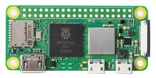
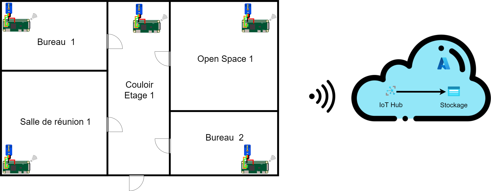

# Documentation Smart building Sopra

## Contexte

L'objectif de ce projet est de fournir une preuve de concept sur la faisabilité d'une installation de type smart building dans les locaux de l'agence Sopra Steria Montpellier.

En d'autres termes, il s'agit de mettre en place une architecture permettant de collecter des données (temperature, humidité, luminosité, etc ...) afin de monitorer l'état des batiments. La collecte de ces données permettra dans un second temps, de pouvoir les analyser afin de réduire la consommation electrique des batiments et d'améliorer le confort des utilisateurs. 

## Architecture

Pour mener ce projet à bien des Raspberry Pi Zero 2 seront implantées dans plusieurs pièces et chaque Raspberry sera rattachée à un ensemble de capteurs.



Ensuite les données issues des capteurs seront collectées grâce au code source exécuté par les Raspberry Pi et seront envoyées dans le cloud Azure afin d'être stockées.



## Capteurs

Pour le moment les capteurs suivants sont supportés :


| Grandeur mesurée     | Support      | Reference                                                                             |
| -------------------- | ------------ | ------------------------------------------------------------------------------------- |
| Temperature          | Total        | [Here](https://docs.sunfounder.com/projects/sensorkit-v2-pi/en/latest/lesson_18.html) |
| Pression             | Total        | [Here](https://learn.sunfounder.com/lesson-31-barometer/)                             |
| Humidité             | Total        | [Here](https://learn.sunfounder.com/lesson-28-humiture-sensor/)                       |
| Gaz (LPG, CO, Fumée) | Total        | [Here](https://docs.sunfounder.com/projects/sensorkit-v2-pi/en/latest/lesson_22.html) |
| Luminosité           | Partiel      | [Here](https://learn.sunfounder.com/lesson-20-photoresistor-module-2/)                |
| Intensité sonore     | Non supporté | [Here](https://learn.sunfounder.com/lesson-19-sound-sensor-2/)                        |

Cette liste est amenée à évoluer dans le futur

## Deploiement de l'architecture

L'architecture est déployée sur chaque Raspberry Pi en ajoutant une crown task au demarrage.

```bash
crontab -e
```

Une fois dans le fichier il faut ajouter à la fin

```
@reboot sh $HOME/SmartBuildingSopra/run.sh
```

## Collecte des données

Pour collecter des données (par exemple la température) plusieurs étapes sont indispensables, tout d'abord il faut acquérir le/les capteurs adéquats.

Ensuite il faut créer une classe permettant de lire les données et de les exporter. 

```python

class AnalogTemperature():
    def __init__(self):
        
        self.configService = configService()
        self.config = self.configService.getConfig()

        self.analogChannel = self.config['Capteurs']['AnalogTemperature']['AIN']
        self.ID = self.config['Capteurs']['AnalogTemperature']['ID']
        self.digitalChannel = self.config['Capteurs']['AnalogTemperature']['GPIO']
        GPIO.setup(self.digitalChannel, GPIO.IN)

    def read(self):
        """Read the input and return the raw value"""
        return ADC.read(self.analogChannel) 

    def readKelvin(self):
        """Read the input and return the temperature expressed in Kelvin"""
        analogVal = self.read()
        Vr = 5 * float(analogVal) / 255
        Rt = 10000 * Vr / (5 - Vr)
        temp = 1/(((math.log(Rt / 10000)) / 3950) + (1 / (273.15+25)))
        return temp

    def readCelcius(self):
        """Read the input and return the temperature expressed in Celcius"""
        return self.readKelvin() - 273.15

    def readFahrenheit(self):
        """Read the input and return the temperature expressed in Fahrenheit"""
        return (self.readCelcius() * 9/5) + 32

    def export(self):
        try : 
            ts = datetime.datetime.now().timestamp()
            return json.dumps({"Temperature Kelvin": self.readKelvin(),"Temperature Celsius": self.readCelcius(), "Temperature Fahrenheit": self.readFahrenheit(), "ID" : self.ID, "Timestamp": ts})
        except : 
            ts = datetime.datetime.now().timestamp()
            return json.dumps({"Temperature Kelvin": None,"Temperature Celsius": None, "Temperature Fahrenheit": None, "ID": self.ID, "Timestamp": ts})

```

Puis le builder associé qui va gérer l'instanciation de l'objet et sa configuration

```python
class AnalogTemperatureBuilder:
    def __init__(self):
        self._instance = None

    def __call__(self):
        
        if self._instance:
            del self._instance
        self._instance = AnalogTemperature()
        return self._instance


```

Une fois les classes créées, il faut ajouter le capteur dans la configuration `config/config.json` soit manuellement, soit via l'API (cf. partie Configuration du système). Dans cet exemple, le capteur est relié au port analogique 1 et au port GPIO 13.

```json
"AnalogTemperature": {
      "Nom": "AnalogTemperature",
      "Type": "Temperature",
      "ID": "salleprojet.temperature",
      "Unit": "°C",
      "Ratio": "10^0",
      "AIN": 1, 
      "GPIO": 13
}
```

Ensuite dans le fichier `services/sensorServiceProvider.py`, il faut mapper l'objet json ajouté avec l'objet python correspondant. Cette etape permettra d'instancier automatiquement le bon objet via une factory en fonction du contenu du fichier de configuration.

```python
services = SensorServiceProvider()
services.register_object('AnalogTemperature', AnalogTemperatureBuilder())
services.register_object('Humiture', HumitureBuilder())
services.register_object('Barometer', BarometerBuilder())
services.register_object('PhotoResistor', PhotoResistorBuilder())
services.register_object('Gas', GasBuilder())
```

Après cette etape il suffit de lancer le script run.sh et les données seront collectées et envoyées dans le cloud Azure.

## Transmission et stockage dans le cloud 

Comme indiqué précedemment, toutes les données collectées sont envoyées dans le cloud Azure pour y être stocker. Pour ce faire, il est necessaire de configurer certains services.

### Iot Hub

Iot Hub est le service Azure qui permet de collecter les données envoyées par les Raspberry, cependant ce service n'est pas capable de stocker directement les données. Il faudra donc l'associer au service de stockage de la plateforme Azure.

Pour configurer Iot Hub, dans un premier temps, il faut créer un hub Iot depuis le portail Azure. Ensuite il faut créer un appareil, cette étape est obligatoire puisqu'elle permet de récupérer un token d'accès qui permet l'envoi des données dans le hub.

Une fois l'appareil créer, il faut donc récuperer le token et l'ajouter dans le fichier `deploy.py`. **Attention à ne pas relever publiquement ce token, sinon tout le monde pourra envoyer des données sur le hub**.

```python
CONNECTION_STRING = "HostName=test-hub-iot-sopra.azure-devices.net;DeviceId=test;SharedAccessKey=XXXXXXXXXXXXXXXXXXXXX"
```

Pour plus de détails ou en cas de difficultés, veuillez vous réferez à la documentation de Microsoft : https://docs.microsoft.com/fr-fr/azure/iot-hub/iot-hub-create-through-portal

### Azure Storage

Pour stocker de manière permanentes les données, il faut ensuite configurer le service de stockage.

La première étape consiste à créer un compte de stockage Azure à partir du portail : https://docs.microsoft.com/fr-fr/azure/storage/common/storage-account-create?tabs=azure-portal

Ensuite il faut créer un conteneur pour stocker les données sous format BLOB : https://docs.microsoft.com/en-us/azure/storage/blobs/storage-quickstart-blobs-portal

Enfin il faut router les messages du Hub Iot vers le stockage Azure : https://docs.microsoft.com/fr-fr/azure/iot-hub/iot-hub-create-through-portal#message-routing-for-an-iot-hub

**Note : Pour la partie requête de routage, si level="critical" ne fonctionne pas, il faut mettre uniquement "true"**

Une fois toutes ces étapes effectuées, les données seront stockées de manière permanentes et pourront être réutilisées.

## Seuil de données

Afin qu'il soit le plus simple possible d'interpreter les différentes données, il a été choisi de mettre en place divers seuils. La définition de ces seuils a été faite en partie grâce aux textes de lois officiels et aux diverses réglémentations dans le monde du travail.

- Bon : Ne représente pas de danger sur le long terme et nécessite pas d'intervention humaine.
- Info : Peut potentiellement représenter un danger sur le long terme mais une absence d'intervention immédiate n'est pas problématique.
- Alarm : Dangerosité à court/moyen terme averée, une intervention humaine doit avoir lieu dans les plus brefs délais pour corriger l'anomalie.

| Grandeur mesurée | Categorie                   | Plage de données                                                                                                                                                                                                                                          | Sources                                                                                                                                                                                                                              |
| ---------------- | --------------------------- | --------------------------------------------------------------------------------------------------------------------------------------------------------------------------------------------------------------------------------------------------------- | ------------------------------------------------------------------------------------------------------------------------------------------------------------------------------------------------------------------------------------ |
| Temperature      | CHSCT Environnement Energie | <ul><li>Bon : 20-22°C</li><li>Info : 22-30°C ou 17-20°C</li><li>Alarm : > 30°C ou < 17°C</li></ul>                                                                                                                                                        | [Lien](https://www.espace-cssct.fr/toutes-les-actualites-du-chsct/quelle-temp%C3%A9rature-maximale-pour-travailler-dans-un-bureau#:~:text=Les%20seuils%20sont%20les%20suivants,travail%20pr%C3%A9sente%20de%20r%C3%A9els%20dangers.) |
| Humidité         | CHSCT                       | <ul><li>Bon : 40% - 60%</li><li>Info : 20% - 70%</li><li>Alarm : < 20% ou > 70%</li></ul>                                                                                                                                                                 | [Lien](https://www.cchst.ca/oshanswers/phys_agents/thermal_comfort.html)                                                                                                                                                             |
| Gaz (CO)         | CHSCT                       | <ul><li>Bon : < 10 ppm</li><li>Info : 10 ppm - 50 ppm</li><li>Alarm : > 50 ppm</li></ul>                                                                                                                                                                  | [Lien](https://travail-emploi.gouv.fr/sante-au-travail/prevention-des-risques-pour-la-sante-au-travail/autres-dangers-et-risques/article/monoxyde-de-carbone)                                                                        |
| Luminosité       | CHSCT Environnement Energie | <ul><li>Couloirs :<ul><li>Bon : 150 lux</li><li>Info : 40 lux</li></ul></li><li>Vestiaires, toilettes :<ul><li>Bon : 200 lux</li><li>Info : 120 lux</li></ul></li><li>Travail de bureau :<ul><li>Bon : 450 lux</li><li>Info : 200 lux</li></ul></li></ul> | [Lien](https://www.legifrance.gouv.fr/codes/section_lc/LEGITEXT000006072050/LEGISCTA000018488932/#LEGISCTA000018532275)                                                                                                              |
| Intensité sonore | CHSCT                       | <ul><li>Bon : < 65 dB</li><li>Info : 65 dB - 80 dB</li><li>Alarm : > 80 dB</li></ul>                                                                                                                                                                      | [Lien](https://www.pytaudio.com/bruit-au-travail/)                                                                                                                                                                                   |


## Configuration du système

Comme mentionné précédemment, il est possible de modifier la configuration des capteurs manuellement, néanmoins cette méthode est déconseillée. En effet, il est recommandé d'utiliser l'API Flask qui est disponible sur le port 5000 de chaque Raspberry Pi.

Des routes ont été spécialement définies : 
En supposant l'adresse de la Raspberry soit 127.0.0.1

```
GET 127.0.0.1:5000/api/config

Retourne : Code HTTP 200 + Le fichier de configuration dans son état actuel

Exemple GET 127.0.0.1:5000/api/config retourne: 
{
  "Hostname": "Raspberry Pi Zero 1",
  "Capteurs": {
    "AnalogTemperature": {
      "Nom": "AnalogTemperature",
      "Type": "Temperature",
      "ID": "salleprojet.temperature",
      "Unit": "°C",
      "Ratio": "10^0",
      "AIN": 1,
      "GPIO": 13
    }
  }
}

Code Erreur :  Code HTTP 500 (erreur serveur)
```

```
POST 127.0.0.1:5000/api/config

Retourne : Code HTTP 200 + {'success':True}

Exemple POST 127.0.0.1:5000/api/config avec le body: 
{
  "Hostname": "Raspberry Pi Zero 1",
  "Capteurs": {
    "AnalogTemperature": {
      "Nom": "AnalogTemperature",
      "Type": "Temperature",
      "ID": "salleprojet.temperature",
      "Unit": "°C",
      "Ratio": "10^0",
      "AIN": 1,
      "GPIO": 13
    }
  }
}

Code Erreur :  
- Code HTTP 500 (erreur serveur)
- Code HTTP 400 (JSON mal formaté)
```

```
GET 127.0.0.1:5000/api/config/sensor/<name>

Retourne : Code HTTP 200 + La configuration du capteur <name>

Exemple GET 127.0.0.1:5000/api/config/sensor/AnalogTemperature retourne: 
{
  "Nom": "AnalogTemperature",
  "Type": "Temperature",
  "ID": "salleprojet.temperature",
  "Unit": "°C",
  "Ratio": "10^0",
  "AIN": 1,
  "GPIO": 13
}

Code Erreur :  
- Code HTTP 500 (erreur serveur)
- Code HTTP 404 (le capteur <name> n'existe pas)
```

```
POST 127.0.0.1:5000/api/config/sensor

Retourne : Code HTTP 200 + {'success':True}

Exemple POST 127.0.0.1:5000/api/config/sensor avec le body: 
{
    "AnalogTemperature": {
      "Nom": "AnalogTemperature",
      "Type": "Temperature",
      "ID": "salleprojet.temperature",
      "Unit": "°C",
      "Ratio": "10^0",
      "AIN": 1,
      "GPIO": 13
    }
}

Code Erreur :  
- Code HTTP 500 (erreur serveur)
- Code HTTP 400 (JSON mal formaté)
```

```
DELETE 127.0.0.1:5000/api/config/sensor/<name>

Retourne : Code HTTP 200 + {'success':True}

Exemple DELETE 127.0.0.1:5000/api/config/sensor/AnalogTemperature

Code Erreur :  
- Code HTTP 500 (erreur serveur)
```

```
GET 127.0.0.1:5000/api/info

Retourne : Code HTTP 200 + Les informations de configuration de la Raspberry Pi et de l'OS

Exemple GET 127.0.0.1:5000/api/info retourne: 
{
    "Architecture": [
        "32bit",
        "ELF"
    ],
    "Machine": "armv7l",
    "Platform": "Linux-5.10.63-v7+-armv7l-with-glibc2.31",
    "Python Version": [
        "3.9.2 (default, Mar 12 2021, 04:06:34) ",
        "[GCC 10.2.1 20210110]"
    ],
    "Release version": "5.10.63-v7+",
    "System name": "Linux",
    "Uname": {
        "machine": "armv7l",
        "node": "raspberrypi",
        "release": "5.10.63-v7+",
        "system": "Linux",
        "version": "#1488 SMP Thu Nov 18 16:14:44 GMT 2021"
    },
    "Version": "#1488 SMP Thu Nov 18 16:14:44 GMT 2021"
}

Code Erreur :  
- Code HTTP 500 (erreur serveur)
```

## Sécurisation du système

L'API utilise le protocole HTTPS pour sécuriser la communication entre la Raspberry et un client  
L'authentification du client est réalisée en fournissant un certificat reconnu par la Raspberry
```
api
└── cert
    ├── keystore
    │   ├── ef613759.0      # clés publiques des certificats des clients autorisés
    │   └── 4efe7786.0  
    ├── cert.pem            # clé publique du certificat de l'API 
    └── key.pem             # clé privée du certificat de l'API             
```

Le nom de la clé publique stockée dans la keystore est de la forme : `<hash>.0` où **\<hash\>** est le hash de l'objet du certificat (peut être obtenu en exécutant la commande `openssl x509 -noout -hash -in client_certificate.pem`)